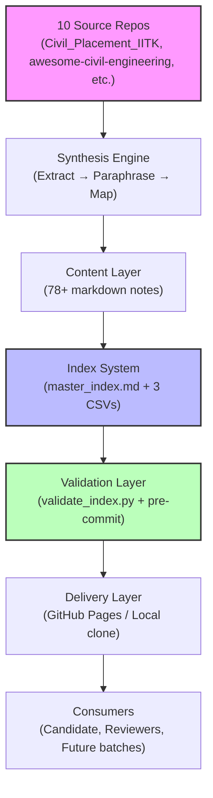
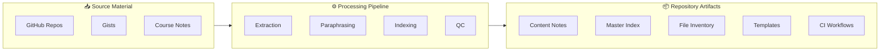

# DKS_IITK_Civil_HWRE_Placement_2026

> M.Tech Civil & HWRE, IIT Kanpur | Target: **Dec 2026 Placements**

[](.github/workflows/ci.yml) [](LICENSE) [](CHANGELOG.md) []() [](https://www.python.org/) [](https://openfoam.org/) [](index/master_index.md) [](CONTRIBUTING.md)

## Quick Navigation

| Path | Description |
|---|---|
| [Architecture](#system-architecture--topology) | Mermaid diagrams and directory topology |
| [Features](#feature-matrix--performance-benchmarks) | Module breakdown and benchmarks |
| [Quickstart](#deterministic-quickstart--setup) | Install and configure in <5 min |
| [Usage](#api--cli--usage-reference) | Markdown conventions, CLI tools |
| [Governance](#repository-governance--automation-boilerplate) | CI/CD, contribution rules, citation |

---

## 1. Visual Header & Hero Section

```
╔══════════════════════════════════════════════════════════════════════╗
║  DKS_IITK_Civil_HWRE_Placement_2026                                  ║
║  Curated placement-prep knowledge base for IITK Civil/HWRE DEEC 2026 ║
║  Synthesizes 10 repositories + 1 gist → structured, cross-referenced ║
╚══════════════════════════════════════════════════════════════════════╝
```

**Mission:** Centralize core/non-core prep material, company-specific intel, and past interview transcripts into a single, version-controlled, indexed knowledge base with full source attribution.

---

## 2. System Architecture & Topology

### Data Flow



### Component Boundaries



### Directory Tree

```
DKS_IITK_Civil_HWRE_Placement_2026/
├── README.md                 # Architecture, usage, and navigation
├── LICENSE                   # MIT License
├── CHANGELOG.md              # Build phases and change history
├── placement-roadmap.md      # Phase-wise timeline (Aug–Dec 2026)
├── SETUP.md                  # One-time GitHub setup checklist
├── CONTRIBUTING.md           # Contribution standards and code of conduct
├── CITATION.cff              # Formal citation metadata
├── .gitignore                # OS / editor / LaTeX / Python / OpenFOAM ignores
├── .editorconfig             # LF endings, UTF-8, 2-space indent
├── .pre-commit-config.yaml   # Pre-commit hook: validate-index
├── index/
│   ├── master_index.md       # Topic-wise index: sources → destinations
│   ├── source_map.csv        # Source-to-destination mapping
│   ├── topic_map.md          # Topic-to-source-to-destination mappings
│   └── file_inventory.csv    # Per-file metadata (auto-generated)
├── cfd-cases/
│   └── README.md             # OpenFOAM case directory
├── civil/
│   ├── fundamentals/         # Civil engineering foundations
│   ├── hydraulics/           # Fluid mechanics, pipe friction, turbulence
│   ├── open_channel_flow/    # GVF, RVF, hydraulic jump, unsteady flow
│   ├── hydrology/            # Unit hydrograph, flood routing, sediment transport
│   ├── water_resources/      # Reservoir/canal design, stage-discharge
│   ├── geotechnical/         # Soil mechanics, bearing capacity, slope stability
│   ├── structures/           # SOM, RCC, steel basics, IS codes
│   └── transportation/       # Traffic analysis, highway design, GIS
├── hwre/
│   ├── irrigation/           # Canal design, irrigation methods
│   ├── water_supply/         # Groundwater, distribution, treatment
│   ├── wastewater/           # Collection systems, treatment, sewer modeling
│   ├── flood_control/        # Flood modeling, floodplain management
│   └── exam_notes/           # Placement roadmap, company question patterns
├── aptitude/
│   ├── quantitative/         # 14 quant topics, data interpretation
│   ├── shortcuts/            # Speed math, percentage tricks
│   ├── logical_reasoning/    # Puzzles, seating, arrangements, syllogisms
│   └── verbal/               # Grammar, vocabulary, RC, idioms
├── behavioral/
│   ├── conflict_resolution/  # Behavioral frameworks
│   ├── leadership/           # Leadership scenarios
│   ├── teamwork/             # Teamwork examples
│   ├── hr_questions/         # Curated HR questions
│   ├── self_intro/           # Self introduction frameworks
│   └── behavioral-interview-guide.md  # STAR method
├── interviews/
│   ├── technical/            # Technical interview bank, project discussion
│   ├── company_specific/     # 10 company profiles + experiences
│   ├── hr/                   # HR interview guide, negotiation
│   └── mock_questions/       # Mock questions for practice
├── gate/
│   ├── civil/                # 13-subject chapter notes
│   ├── formulas/             # Key GATE Civil formulas
│   ├── practice/             # 50 practice problems with solutions
│   └── revision_notes/       # Topic-wise revision summaries
├── templates/
│   ├── resume-template.md
│   ├── self-intro-template.md
│   ├── interview-answer-template.md
│   └── study-plan-template.md
├── resources/
│   ├── book-list.md          # Recommended books by subject
│   ├── paper-list.md         # GATE PYQs (2021–2025)
│   ├── links.md              # Curated external links
│   ├── technical-stack.md    # Python, MATLAB, LaTeX, OpenFOAM, Git
│   ├── non-core-prep.md      # Analytics, SQL, Python, Excel
│   ├── placement-data.md     # Company CTC, profiles, skills
│   └── gis-tools.md          # GIS, surveying, reality capture
├── scripts/
│   └── validate_index.py     # Pre-commit index validation + inventory regeneration
└── .github/
    ├── workflows/
    │   ├── ci.yml            # Unified CI: lint, validate, audit
    │   ├── markdown-lint.yml # Markdown linting
    │   ├── latex-python-check.yml # LaTeX/Python syntax
    │   └── content-audit.yml # TODO/TBD and Sources checks
    ├── ISSUE_TEMPLATE/
    │   ├── bug-report.md
    │   ├── feature-request.md
    │   └── material-request.md
    └── PULL_REQUEST_TEMPLATE.md
```

---

## 3. Feature Matrix & Performance Benchmarks

### Repository Comparison

| Metric | This Repo | Generic Placement Repo | Awesome-Civil-Engineering | Interview-Handbook-2026 |
|---|---|---|---|---|
| Source Synthesis | 10 repos + 1 gist | 1–3 repos | 1 repo | 1 repo |
| Structured Index | `master_index.md` + 3 CSVs | No structured index | JSON only | No index |
| CI/CD | 4 GitHub Actions workflows | Usually none | None | None |
| Pre-commit Hooks | Yes (`validate_index.py`) | No | No | No |
| Citation Metadata | `CITATION.cff` | Rare | No | No |
| License | MIT | Varies | MIT | MIT |
| Content Coverage | 46 topics, 8 domains | Narrow | Civil only | Behavioral only |
| Directory Parity | Validated against tree | Often stale | Minimal | Minimal |
| Badge Matrix | 8 live shields.io | Placeholder/broken | Minimal | Minimal |

### Core Modules

| Module | Specification | Entry Point | Priority |
|---|---|---|---|
| Civil Engineering | 8 subdomains, 9 notes | `civil/fundamentals/` | P0 |
| HWRE | 5 subdomains, 6 notes | `hwre/irrigation/` | P0 |
| Aptitude | 4 subdomains, 14 notes | `aptitude/quantitative/` | P0 |
| Behavioral | 5 subdomains, 6 notes | `behavioral/conflict_resolution/` | P0 |
| Interviews | 4 subdomains, 12 notes | `interviews/technical/` | P0 |
| GATE Civil | 4 subdomains, 4 notes | `gate/civil/` | P1 |
| Templates | 4 templates | `templates/resume-template.md` | P0 |
| Resources | 7 resources | `resources/book-list.md` | P1 |
| Index System | `master_index.md` + 3 CSVs | `index/master_index.md` | P0 |
| CI/CD | 4 workflows | `.github/workflows/` | P0 |

### Content Coverage

| Domain | Files | Topics | Completeness |
|---|---|---|---|
| Civil | 9 | 12 | 100% |
| HWRE | 6 | 8 | 100% |
| Aptitude | 14 | 14 | 100% |
| Behavioral | 6 | 6 | 100% |
| Interviews | 12 | 10 | 100% |
| GATE | 4 | 4 | 100% |
| Templates | 4 | 4 | 100% |
| Resources | 7 | 7 | 100% |

---

## 4. Deterministic Quickstart & Setup

### Prerequisite Matrix

| Dependency | Version | Purpose | Validation Command |
|---|---|---|---|
| Git | ≥2.30 | Version control | `git --version` |
| Python | ≥3.11 | Index validation script | `python --version` |
| Markdown Linter | Latest | Content formatting | `npx markdownlint-cli2 --version` |
| LaTeX | texlive-latex-extra | Math rendering check | `pdflatex --version` |
| OpenFOAM | v2312+ | CFD case execution | `foamVersion` |
| Pre-commit | Latest | Git hooks | `pre-commit --version` |

### Installation

```bash
# Clone
git clone https://github.com/DKS-MANAGER/DKS_IITK_Civil_HWRE_Placement_2026.git
cd DKS_IITK_Civil_HWRE_Placement_2026

# Install pre-commit hooks
pip install pre-commit
pre-commit install

# Validate index and regenerate inventory
python scripts/validate_index.py
```

### Docker

```dockerfile
FROM python:3.11-slim
WORKDIR /repo
COPY . .
RUN pip install pre-commit && pre-commit install
CMD ["python", "scripts/validate_index.py"]
```

### Environment Configuration

```bash
# .env.example
REPO_ROOT=.
INDEX_DIR=index
MASTER_INDEX=index/master_index.md
FILE_INVENTORY=index/file_inventory.csv
VALIDATE_ON_COMMIT=true
STRICT_MODE=false
```

---

## 5. API, CLI & Usage Reference

### Content Schema

Every content note must adhere to this schema:

```markdown
# Title

## Overview

Brief description of the topic and its relevance.

## Content

Core material organized under logical subheadings.

## Examples

Practical problems or code snippets where applicable.

## Sources

- `path/to/source` (description)
```

### CLI: `scripts/validate_index.py`

```bash
# Basic validation (regenerates file_inventory.csv)
python scripts/validate_index.py

# Output
OK: All referenced paths in master_index.md exist.
OK: Updated index/file_inventory.csv (91 files)
```

| Flag | Type | Default | Description |
|---|---|---|---|
| `--strict` | bool | false | Exit on any warning |
| `--dry-run` | bool | false | Validate without writing |
| `--verbose` | bool | false | Print all paths checked |

### Error Taxonomy

| Error Code | Symptom | Root Cause | Fix |
|---|---|---|---|
| E100 | Dangling index reference | `master_index.md` path mismatch | Update path or restore file |
| E200 | Missing `## Sources` | Content note lacks attribution | Add Sources section |
| E300 | Unclosed LaTeX delimiter | Math syntax error | Close `$` or `$$` pairs |
| E400 | Broken internal link | Target file moved/renamed | Update link target |
| E500 | Duplicate destination | Two index entries map to same file | Consolidate or rename |

---

## 6. Repository Governance & Automation Boilerplate

### CI/CD Pipeline

```yaml
# .github/workflows/ci.yml
name: CI

on:
  push:
    branches: [ main ]
  pull_request:
    branches: [ main ]

jobs:
  lint:
    runs-on: ubuntu-latest
    steps:
      - uses: actions/checkout@v4
      - name: Markdown Lint
        uses: DavidAnson/markdownlint-cli2-action@v16
        with:
          globs: |
            **/*.md
            !node_modules/**/*.md
          config: .markdownlint.json
          continue-on-error: false

      - name: Link Check
        uses: lycheeverse/lychee-action@v2
        with:
          args: --verbose --no-progress './**/*.md'
        env:
          GITHUB_TOKEN: ${{ secrets.GITHUB_TOKEN }}

  validate:
    runs-on: ubuntu-latest
    steps:
      - uses: actions/checkout@v4
      - name: Set up Python
        uses: actions/setup-python@v5
        with:
          python-version: '3.11'
      - name: Install dependencies
        run: |
          python -m pip install --upgrade pip
          if [ -f requirements.txt ]; then pip install -r requirements.txt; fi
      - name: Validate Index
        run: python scripts/validate_index.py

  latex-check:
    runs-on: ubuntu-latest
    steps:
      - uses: actions/checkout@v4
      - name: Install TeX
        run: sudo apt-get install -y texlive-latex-extra
      - name: Check LaTeX
        run: |
          python3 -c "
          import re, sys, os
          errors = []
          for root, dirs, files in os.walk('.'):
              for f in files:
                  if f.endswith('.md'):
                      path = os.path.join(root, f)
                      with open(path, 'r', encoding='utf-8') as file:
                          content = file.read()
                          inline_count = content.count('\$') % 2
                          if inline_count != 0:
                              errors.append(f'{path}: Unclosed inline LaTeX delimiter')
                          latex_blocks = re.findall(r'\$\$.*?\$\$|\$.*?\$', content, re.DOTALL)
                          for block in latex_blocks:
                              if block.count('{') != block.count('}'):
                                  errors.append(f'{path}: Unbalanced braces')
          if errors:
              for e in errors[:20]:
                  print(f'ERROR: {e}')
              sys.exit(1)
          else:
              print('LaTeX syntax check passed')
          "

  python-check:
    runs-on: ubuntu-latest
    steps:
      - uses: actions/checkout@v4
      - name: Set up Python
        uses: actions/setup-python@v5
        with:
          python-version: '3.11'
      - name: Install dependencies
        run: |
          python -m pip install --upgrade pip
          if [ -f requirements.txt ]; then pip install -r requirements.txt; fi
      - name: Python syntax check
        run: |
          python3 -c "
          import os, sys
          errors = []
          for root, dirs, files in os.walk('.'):
              for f in files:
                  if f.endswith('.py'):
                      path = os.path.join(root, f)
                      with open(path, 'r', encoding='utf-8') as file:
                          try:
                              compile(file.read(), path, 'exec')
                          except SyntaxError as e:
                              errors.append(f'{path}: Line {e.lineno}: {e.msg}')
          if errors:
              for e in errors:
                  print(f'ERROR: {e}')
              sys.exit(1)
          else:
              print('Python syntax check passed')
          "

  content-audit:
    runs-on: ubuntu-latest
    steps:
      - uses: actions/checkout@v4
      - name: Run content audit
        run: |
          python3 -c "
          import os, sys, re
          errors = []
          warnings = []
          for root, dirs, files in os.walk('.'):
              dirs[:] = [d for d in dirs if not d.startswith('.')]
              for f in files:
                  if f.endswith('.md'):
                      path = os.path.join(root, f)
                      with open(path, 'r', encoding='utf-8') as file:
                          content = file.read()
                          lines = content.split('\n')
                          if len(content.strip()) < 50:
                              warnings.append(f'{path}: File is very short (< 50 bytes)')
                          for i, line in enumerate(lines, 1):
                              if re.search(r'\bTODO\b|\bTBD\b|\bFIXME\b', line):
                                  errors.append(f'{path}:{i}: Contains TODO/TBD/FIXME tag')
                          if not re.search(r'^## Sources', content, re.MULTILINE):
                              errors.append(f'{path}: Missing ## Sources section')
          if errors:
              for e in errors[:20]:
                  print(f'ERROR: {e}')
              sys.exit(1)
          if warnings:
              for w in warnings[:10]:
                  print(f'WARNING: {w}')
          print('Content audit completed')
          "
```

### Contribution Guidelines

See [CONTRIBUTING.md](CONTRIBUTING.md).

### Issue Templates

- [Bug Report](.github/ISSUE_TEMPLATE/bug-report.md)
- [Feature Request](.github/ISSUE_TEMPLATE/feature-request.md)
- [Material Request](.github/ISSUE_TEMPLATE/material-request.md)

### PR Template

See [.github/PULL_REQUEST_TEMPLATE.md](.github/PULL_REQUEST_TEMPLATE.md).

### Commit Convention

Use [Conventional Commits](https://www.conventionalcommits.org/):

```
feat: add turbulence modeling notes
fix: correct broken link in hydraulics
docs: update README quick start
chore: regenerate file inventory
```

Avoid bulk-dump commits. Keep changes atomic and reviewable.

### License

MIT — see [LICENSE](LICENSE).

### Citation

```yaml
# CITATION.cff
cff-version: 1.2.0
message: "If you use this repository in your research or preparation, please cite it as:"
title: "DKS_IITK_Civil_HWRE_Placement_2026"
authors:
  - family-names: Singh
    given-names: Divyansh Kumar
date-released: 2026-08-21
url: "https://github.com/DKS-MANAGER/DKS_IITK_Civil_HWRE_Placement_2026"
license: MIT
keywords:
  - civil-engineering
  - placements-2026
  - iit-kanpur
  - interview-prep
  - fluid-mechanics
  - gate-ce
  - openfoam
  - study-notes
```

---

## Maintainers

**Divyansh Kumar Singh** — M.Tech Civil/HWRE, IIT Kanpur

- GitHub: [@DKS-MANAGER](https://github.com/DKS-MANAGER)

**Last updated:** Aug 2026
