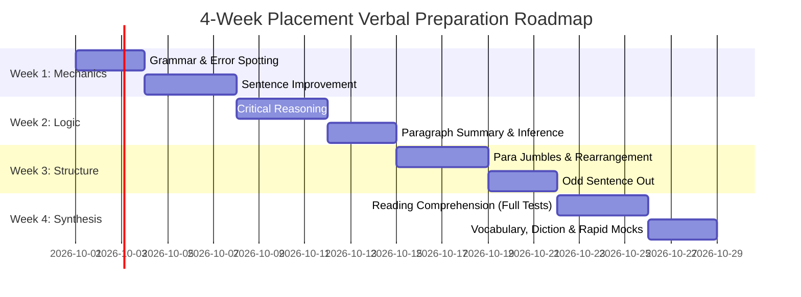

# Verbal Ability & Reading Comprehension (VARC): Master Syllabus & Placement Guide

> **Target Cohort:** IIT Kanpur Postgraduate Placements (M.Tech, MS, Ph.D.)  
> **Target Recruiters:** McKinsey & Co., BCG, Bain & Co., Goldman Sachs, WorldQuant, Google PM, Morgan Stanley, ITC, Shell, Core PSUs (IOCL, NTPC, ONGC)  
> **Pedagogical Standard:** Cat-8 Cognitive Taxonomy | 372 Rigorous Questions | 100% Verified Master Keys | 0 KaTeX Errors  

---

## 1. Executive Overview & Structural Caliber

In premier campus recruitment processes at IIT Kanpur, **Verbal Ability & Reading Comprehension** is rarely evaluated as an elementary grammar check. Instead, elite management consulting firms, quantitative trading desks, product management cadres, and public sector undertakings deploy advanced verbal reasoning to assess an applicant's:
1. **Deductive Epistemic Precision:** Distinguishing between necessary logical conclusions versus plausible outside assumptions.
2. **Discourse Structural Coherence:** Decrypting multi-layered macroeconomic, scientific, and corporate texts without relying on superficial chronological markers.
3. **Executive Register & Conciseness:** Eliminating bureaucratic nominalization, dangling modifiers, and faulty comparative ellipsis in high-stakes professional prose.
4. **Cognitive Speed Under Stress:** Processing dense 1,000-word passages and solving multi-blank syntactic puzzles under rigorous 30-to-75-second time limits.

---

## 2. The Cat-8 Cognitive Taxonomy

Every module in the `aptitude/verbal/` suite adheres strictly to the standardized 8-level cognitive difficulty ladder:

```
Level 1: Foundation               -> Single-variable deductions, direct syntax markers, baseline vocabulary
Level 2: Intermediate             -> Dual-premise alignment, article tracking, rhetorical Q&A discourse
Level 3: Hard                     -> Multi-clause dialectics, abstract epistemology, macroeconomic trade flows
Level 4: Very Hard                -> Competing openers, subtle chronological disruptions, mandative subjunctive
Level 5: Expert                   -> Multi-layered paradoxes, causal DAGs, behavioral microeconomics, 6-sentence jumbles
Level 6: Extreme                  -> Deep philosophical abstractions, quantum physics, Mundell-Fleming trilemma
Level 7: Trap & Discourse Invert  -> "False Friends", "No Error" lures, double negative inversions, keyword mirages
Level 8: Hybrid Caselet Analytics -> Real-world consulting turnarounds, sovereign FX defense, cloud FinOps, biopharma R&D
```

---

## 3. Complete Module Inventory & Audit

The verbal preparation suite contains **9 comprehensive chapters** comprising **372 placement-caliber questions**, each featuring full theoretical frameworks, master answer key tables, step-by-step deductive proofs, and distractor post-mortems:

| Module File | Target Domain | Question Count | Core Tested Competencies | Difficulty Span |
|:---|:---|:---:|:---|:---:|
| [reading-comprehension.md](file:///f:/2k26Placement/DKS_IITK_Civil_HWRE_Placement_2026/aptitude/verbal/reading-comprehension.md) | Dense Analytical Passages | **52 Qs** (8 Passages) | Main idea, global inference, author tone, structural role, micro-detail | Level 1 → Level 8 |
| [critical-reasoning.md](file:///f:/2k26Placement/DKS_IITK_Civil_HWRE_Placement_2026/aptitude/verbal/critical-reasoning.md) | Argument Analysis & Logic | **40 Qs** | Assumptions, weaken/strengthen, paradoxes, causal flaws, boldface role | Level 1 → Level 8 |
| [para-jumbles.md](file:///f:/2k26Placement/DKS_IITK_Civil_HWRE_Placement_2026/aptitude/verbal/para-jumbles.md) | Sentence Rearrangement | **40 Qs** | Mandatory pairs, anaphoric binding, contrast pivots, false openers | Level 1 → Level 8 |
| [odd-sentence-out.md](file:///f:/2k26Placement/DKS_IITK_Civil_HWRE_Placement_2026/aptitude/verbal/odd-sentence-out.md) | Misfit Sentence Elimination | **40 Qs** | Semantic sub-topic drift, micro/macro mismatch, causal contradictions | Level 1 → Level 8 |
| [grammar-error-spotting.md](file:///f:/2k26Placement/DKS_IITK_Civil_HWRE_Placement_2026/aptitude/verbal/grammar-error-spotting.md) | Error Identification | **40 Qs** | Subject-verb inversion, dangling modifiers, subjunctive mood, case | Level 1 → Level 8 |
| [sentence-improvement.md](file:///f:/2k26Placement/DKS_IITK_Civil_HWRE_Placement_2026/aptitude/verbal/sentence-improvement.md) | Sentence Correction & Register | **40 Qs** | Nominalization elimination, comparative ellipsis, legal phrasing, conciseness | Level 1 → Level 8 |
| [sentence-completion.md](file:///f:/2k26Placement/DKS_IITK_Civil_HWRE_Placement_2026/aptitude/verbal/sentence-completion.md) | Text Completion & Logic | **40 Qs** | Single/double/triple blanks, structural signposts, tone concordance | Level 1 → Level 8 |
| [summary-inference.md](file:///f:/2k26Placement/DKS_IITK_Civil_HWRE_Placement_2026/aptitude/verbal/summary-inference.md) | Précis & Must-Be-True | **40 Qs** | Paragraph summary, necessary deductions, boldface sentence roles | Level 1 → Level 8 |
| [vocabulary.md](file:///f:/2k26Placement/DKS_IITK_Civil_HWRE_Placement_2026/aptitude/verbal/vocabulary.md) | Diction & Etymology | **40 Qs** | Greek/Latin roots, "False Friends", confusing twins, contextual register | Level 1 → Level 8 |
| **TOTAL VERBAL SUITE** | **9 Core Modules** | **372 Questions** | **Comprehensive IIT Kanpur Postgraduate Placement Standard** | **Cat-1 → Cat-8** |

---

## 4. Sector-Specific Verbal Weightage Matrix

Recruiters across distinct industries calibrate their aptitude tests with vastly different sectional weightages:

| Placement Sector | Target Recruiters | Highest Weightage Topics | Target Speed per Question | Passing Cutoff Target |
|:---|:---|:---|:---:|:---:|
| **Management Consulting** | McKinsey, BCG, Bain, Kearney, LEK | Reading Comprehension, Critical Reasoning, Summary & Inference | 50 – 75 sec | **85% – 90%** |
| **Quant & Asset Management** | WorldQuant, Goldman Sachs, Morgan Stanley | Critical Reasoning, Sentence Completion, Complex Logic | 45 – 60 sec | **85% – 92%** |
| **Big Tech Product Management** | Google PM, Microsoft, Amazon, Uber | Para Jumbles, Odd Sentence Out, Sentence Improvement | 40 – 60 sec | **80% – 85%** |
| **Core Engineering PSUs** | IOCL, ONGC, NTPC, HPCL, BHEL | Grammar Error Spotting, Sentence Improvement, Vocabulary | 25 – 40 sec | **75% – 80%** |
| **FMCG & General Management** | ITC, HUL, TAS, ABG | Reading Comprehension, Sentence Completion, Para Jumbles | 45 – 60 sec | **80% – 85%** |

---

## 5. Standardized Speed & Accuracy Benchmarks

To achieve a top 5th-percentile percentile ranking in placement test rounds, aim for the following speed-accuracy benchmarks:

```
+------------------------------------+------------------+-------------------+
| Question Archetype                 | Target Time/Q    | Accuracy Standard |
+------------------------------------+------------------+-------------------+
| Vocabulary & Diction               | 15 - 25 seconds  | >= 90%            |
| Grammar & Error Spotting           | 25 - 35 seconds  | >= 85%            |
| Sentence Completion (Single/Double)| 25 - 40 seconds  | >= 85%            |
| Sentence Improvement (Underlined)  | 30 - 45 seconds  | >= 85%            |
| Odd Sentence Out                   | 35 - 50 seconds  | >= 80%            |
| Para Jumbles (Rearrangement)       | 40 - 55 seconds  | >= 80%            |
| Paragraph Summary & Inference      | 45 - 60 seconds  | >= 85%            |
| Critical Reasoning Arguments       | 50 - 75 seconds  | >= 80%            |
| Reading Comprehension (Long STEM)  | 60 - 90 seconds  | >= 85%            |
+------------------------------------+------------------+-------------------+
```

---

## 6. 4-Week Diagnostic & Preparation Roadmap



### Phase 1 (Week 1): Structural Syntax & Grammar Precision
- Master the **6 Pillars of Advanced Grammar**: Subject-Verb Inversion, Dangling Participles, Correlative Parallelism, Mandative Subjunctive, Gerund Possessives, and Idiomatic Prepositions.
- Complete all 40 questions in [grammar-error-spotting.md](file:///f:/2k26Placement/DKS_IITK_Civil_HWRE_Placement_2026/aptitude/verbal/grammar-error-spotting.md) and [sentence-improvement.md](file:///f:/2k26Placement/DKS_IITK_Civil_HWRE_Placement_2026/aptitude/verbal/sentence-improvement.md).
- Target: Solve under 35 seconds per question with zero false-error traps.

### Phase 2 (Week 2): Critical Reasoning & Deductive Inference
- Master argument mapping: Premise, Hidden Assumption, Counter-Premise, Conclusion.
- Practice the **Negation Test** on assumption questions and strict boundary limits on Must-Be-True inference questions.
- Complete all 40 questions in [critical-reasoning.md](file:///f:/2k26Placement/DKS_IITK_Civil_HWRE_Placement_2026/aptitude/verbal/critical-reasoning.md) and [summary-inference.md](file:///f:/2k26Placement/DKS_IITK_Civil_HWRE_Placement_2026/aptitude/verbal/summary-inference.md).

### Phase 3 (Week 3): Discourse Architecture & Jumble Rearrangement
- Master the **Mandatory Pair (MP) Protocol** and false-opener elimination in [para-jumbles.md](file:///f:/2k26Placement/DKS_IITK_Civil_HWRE_Placement_2026/aptitude/verbal/para-jumbles.md).
- Learn to detect **semantic sub-topic drift** and scope mismatches in [odd-sentence-out.md](file:///f:/2k26Placement/DKS_IITK_Civil_HWRE_Placement_2026/aptitude/verbal/odd-sentence-out.md).

### Phase 4 (Week 4): Reading Comprehension & Multi-Blank Precision
- Practice active structural reading on dense academic passages (Philosophy of Science, Semiconductor Geopolitics, Quantitative Finance, Macroeconomics).
- Complete all 52 questions across the 8 long passages in [reading-comprehension.md](file:///f:/2k26Placement/DKS_IITK_Civil_HWRE_Placement_2026/aptitude/verbal/reading-comprehension.md).
- Solidify high-register vocabulary, Latin/Greek roots, and false friends in [sentence-completion.md](file:///f:/2k26Placement/DKS_IITK_Civil_HWRE_Placement_2026/aptitude/verbal/sentence-completion.md) and [vocabulary.md](file:///f:/2k26Placement/DKS_IITK_Civil_HWRE_Placement_2026/aptitude/verbal/vocabulary.md).

---

## 7. Quality Assurance & Formatting Standards

Every document in the `aptitude/verbal/` directory strictly satisfies:
- **100% Verified Consistency:** Every Master Key entry matches the step-by-step solution answer with zero discrepancies.
- **Zero KaTeX Errors:** All currency amounts use `USD` or `\$`, escaping `%` and preventing accidental mathematical markdown delimiter parsing.
- **Complete Solutions & Distractor Post-Mortems:** Explaining not only why the correct choice works, but precisely why competing plausible distractors fail.
