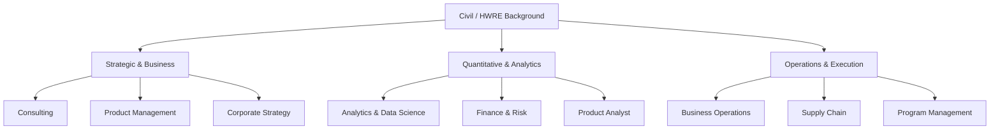

# Non-Core Master Role Directory

> Comprehensive Directory & Preparation Blueprint for all 14 Non-Core Industry Tracks at IIT Kanpur (Placement 2026).  
> Designed specifically for Civil Engineering & Hydro-systems Engineering (HWRE) graduates targeting corporate, consulting, analytics, and leadership profiles.

---

## 🏛️ Role Track Directory Matrix

| # | Role Track | Primary Focus & Domain Levers | Required Technical Stack | IITK Civil / HWRE Competitive Edge | Track Link |
|---|:---|:---|:---|:---|:---|
| 01 | **Management Consulting** | Profitability, market entry, M&A, operational turnarounds, MECE trees | Advanced Excel, PowerPoint, Think-Cell, Issue Trees | Complex physical systems analysis, structured logic, project execution | [01_roles/consulting/](01_roles/consulting/) |
| 02 | **Analytics & Data Science** | Predictive modeling, SQL pipelines, statistical inference, A/B tests | SQL, Python (Pandas/NumPy/Scikit-learn), Tableau | Advanced mathematical modeling, numerical methods, large-scale data wrangling | [01_roles/analytics/](01_roles/analytics/) |
| 03 | **Business Analyst (BA)** | Requirement gathering, SQL queries, KPI dashboards, process mapping | SQL, Power BI, Advanced Excel, Jira, BPMN | Cross-disciplinary coordination, technical-to-business translation | [01_roles/business-analyst/](01_roles/business-analyst/) |
| 04 | **Data Analyst (DA)** | Exploratory data analysis, cohort analysis, dashboard automation | SQL, Python/R, Tableau, Power BI, Excel | Hydrological/spatial data handling, statistical hypothesis testing | [01_roles/data-analyst/](01_roles/data-analyst/) |
| 05 | **Business Operations (BizOps)** | Cross-functional strategy, unit economics, process scaling, supply-demand | Excel, SQL, Tableau, Process Flow Diagrams | Multi-variable optimization, resource balancing, engineering workflow design | [01_roles/business-operations/](01_roles/business-operations/) |
| 06 | **Operations Management** | Queueing models, inventory management (EOQ), Six Sigma, Little's Law | ERP platforms, Excel, Supply/Demand Optimization | Infrastructure operations, site management, capacity constraints | [01_roles/operations/](01_roles/operations/) |
| 07 | **Product Management (PM)** | Product sense, user discovery, CIRCLES framework, roadmap prioritization | Figma, Jira, Metrics/Telemetry, SQL, Amplitude | Systems-level product thinking, engineering empathy, structured prioritization | [01_roles/product-management/](01_roles/product-management/) |
| 08 | **Product Analyst** | Feature experimentation, funnel drop-off, user cohort retention | SQL, Python, Amplitude, Mixpanel, Statsmodels | Rigorous scientific method, controlled experimental design, data analysis | [01_roles/product-analyst/](01_roles/product-analyst/) |
| 09 | **Program Management (PgM)** | Critical Path Method (CPM/PERT), risk registers, stakeholder RACI matrix | MS Project, Jira, Asana, Gantt Charts | Large-scale construction scheduling, milestone-driven delivery | [01_roles/program-management/](01_roles/program-management/) |
| 10 | **Corporate Strategy** | Porter's 5 Forces, 3Cs, 7 Powers, growth vectors, market entry | Financial Models, Valuation Ratios, PPT | Macro-economic infrastructure planning, capital allocation logic | [01_roles/strategy/](01_roles/strategy/) |
| 11 | **Supply Chain Management** | Bullwhip effect, multi-echelon inventory, logistics, safety stock | Supply Chain Solvers, Excel Solver, SAP/ERP | Hydraulic flow network analogy, distribution network optimization | [01_roles/supply-chain/](01_roles/supply-chain/) |
| 12 | **Finance & FinTech** | Financial statement analysis (3-Statement), DCF valuation, working capital | Excel Financial Modeling, Python for Finance | Mathematical calculus, quantitative rigor, risk assessment | [01_roles/finance/](01_roles/finance/) |
| 13 | **Risk Management** | Credit risk, market VaR, Basel frameworks, stress testing, default probability | Python, R, SQL, Monte Carlo Simulation | Probabilistic flood/hydrology modeling, stochastic risk modeling | [01_roles/risk/](01_roles/risk/) |
| 14 | **Technology & Systems** | Tech consulting, system architecture, API ecosystems, cloud pipelines | System Design, SQL/NoSQL, APIs, Cloud Basics | Computational pipeline building, software integration experience | [01_roles/technology/](01_roles/technology/) |

---

## 🎯 Deep Role Profiles & Preparation Pathways

---

### Track 01: Management Consulting
- **Target Companies**: McKinsey & Company, Boston Consulting Group (BCG), Bain & Company, Kearney, Strategy&, Oliver Wyman, Arthur D. Little, EY-Parthenon, PwC DI.
- **Selection Architecture**: Resume Shortlist $\rightarrow$ Aptitude/Pymetrics $\rightarrow$ Buddy Round Case $\rightarrow$ Partner Case Rounds (2-3 rounds) $\rightarrow$ Fit/Leadership.
- **Core Modules**:
  * [Role Overview](01_roles/consulting/01_role-overview.md)
  * [Live Case Practice Bank](01_roles/consulting/06_case-practice.md)
  * [4-Block Milestone Study Plan](01_roles/consulting/08_role-study-plan.md)
  * [Rapid Revision Sheet](01_roles/consulting/09_rapid-revision.md)
- **Shared Prerequisite Tools**:
  * [Shared Case Framework Library](02_interview-preparation/case-interviews/framework-library.md)
  * [Guesstimate Master Guide](02_interview-preparation/guesstimates/guesstimate-guide.md)
  * [Structured Problem Solving (MECE)](03_common-skills/structured-problem-solving/structured-problem-solving.md)

---

### Track 02: Analytics & Data Science
- **Target Companies**: Fractal Analytics, Tiger Analytics, EXL Service, Mu Sigma, ZS Associates, Cartesian Consulting, LatentView.
- **Selection Architecture**: Online Assessment (SQL + Quant + ML) $\rightarrow$ Technical Round (Live SQL/Python coding) $\rightarrow$ Business Case / Machine Learning Discussion $\rightarrow$ HR.
- **Core Modules**:
  * [Role Overview](01_roles/analytics/01_role-overview.md)
  * [Tools & Technical Stack](01_roles/analytics/04_tools-and-technical-stack.md)
  * [Milestone Study Plan](01_roles/analytics/08_role-study-plan.md)
  * [Rapid Revision Sheet](01_roles/analytics/09_rapid-revision.md)
- **Shared Prerequisite Tools**:
  * [Aptitude Bridge](03_common-skills/quantitative-reasoning/aptitude-bridge.md)
  * [Data Interpretation Guide](03_common-skills/data-interpretation/data-interpretation.md)

---

### Track 03: Business Analyst (BA)
- **Target Companies**: Deloitte USI, PwC, EY, KPMG, Accenture Strategy & Consulting, American Express, Capital One, Flipkart, Amazon.
- **Selection Architecture**: Aptitude & Data Interpretation OA $\rightarrow$ SQL/Guesstimate Round $\rightarrow$ Business Problem Solving Round $\rightarrow$ Behavioral.
- **Core Modules**:
  * [Role Overview](01_roles/business-analyst/01_role-overview.md)
  * [Tools, Dashboards & SQL](01_roles/business-analyst/04_tools-and-technical-stack.md)
  * [Study Plan](01_roles/business-analyst/08_role-study-plan.md)
  * [Rapid Revision](01_roles/business-analyst/09_rapid-revision.md)

---

### Track 04: Data Analyst (DA)
- **Target Companies**: Swiggy, Zomato, Uber, Walmart Global Tech, Myntra, Meesho, Jio, Paytm.
- **Selection Architecture**: HackerRank SQL/Coding OA $\rightarrow$ Live EDA/SQL Case $\rightarrow$ Metrics & Root Cause Analysis Round $\rightarrow$ Culture Fit.
- **Core Modules**:
  * [Role Overview](01_roles/data-analyst/01_role-overview.md)
  * [Statistics & Tech Stack](01_roles/data-analyst/04_tools-and-technical-stack.md)
  * [Study Plan](01_roles/data-analyst/08_role-study-plan.md)
  * [Rapid Revision](01_roles/data-analyst/09_rapid-revision.md)

---

### Track 05: Business Operations (BizOps)
- **Target Companies**: Flipkart, Amazon, Uber, Ola, Delhivery, Zepto, Blinkit, Urban Company.
- **Selection Architecture**: Analytical Assessment $\rightarrow$ Operational Bottleneck Case $\rightarrow$ Metric Root Cause Analysis $\rightarrow$ Executive Round.
- **Core Modules**:
  * [Role Overview](01_roles/business-operations/01_role-overview.md)
  * [Study Plan](01_roles/business-operations/08_role-study-plan.md)
  * [Rapid Revision](01_roles/business-operations/09_rapid-revision.md)

---

### Track 06: Operations Management
- **Target Companies**: Procter & Gamble, Unilever, ITC, Tata Steel, Reliance Industries, L'Oréal, JSW.
- **Selection Architecture**: Domain OA $\rightarrow$ Group Discussion (Supply/Ops bottleneck) $\rightarrow$ Technical Plant/Process Case $\rightarrow$ Leadership Interview.
- **Core Modules**:
  * [Role Overview](01_roles/operations/01_role-overview.md)
  * [Study Plan](01_roles/operations/08_role-study-plan.md)
  * [Rapid Revision](01_roles/operations/09_rapid-revision.md)

---

### Track 07: Product Management (PM)
- **Target Companies**: Microsoft (APM), Google (APM), Flipkart (APM), PhonePe, Razorpay, CRED, Meesho, MakeMyTrip.
- **Selection Architecture**: Product Teardown / Assignment $\rightarrow$ Product Design (CIRCLES) Round $\rightarrow$ Product Strategy & Metrics Round $\rightarrow$ Engineering Collaboration Round $\rightarrow$ Director Round.
- **Core Modules**:
  * [Role Overview](01_roles/product-management/01_role-overview.md)
  * [Core Knowledge & Metrics](01_roles/product-management/03_core-knowledge.md)
  * [Interview Preparation & Product Sense](01_roles/product-management/05_interview-preparation.md)
  * [Study Plan](01_roles/product-management/08_role-study-plan.md)
  * [Rapid Revision](01_roles/product-management/09_rapid-revision.md)

---

### Track 08: Product Analyst
- **Target Companies**: Groww, Zepto, CRED, Dream11, Swiggy, Nykaa, InMobi.
- **Selection Architecture**: SQL & Experimentation OA $\rightarrow$ Funnel Analytics Case $\rightarrow$ A/B Test Design & Pitfall Round $\rightarrow$ Hiring Manager.
- **Core Modules**:
  * [Role Overview](01_roles/product-analyst/01_role-overview.md)
  * [Study Plan](01_roles/product-analyst/08_role-study-plan.md)
  * [Rapid Revision](01_roles/product-analyst/09_rapid-revision.md)

---

### Track 09: Program Management (PgM)
- **Target Companies**: Amazon, Google, Microsoft, Adobe, Cisco, Larsen & Toubro, Tata Projects.
- **Selection Architecture**: Behavioral / Leadership OA $\rightarrow$ Cross-Functional Trade-Off Case $\rightarrow$ CPM Scheduling & Risk Analysis $\rightarrow$ Executive Bar Raiser.
- **Core Modules**:
  * [Role Overview](01_roles/program-management/01_role-overview.md)
  * [Study Plan](01_roles/program-management/08_role-study-plan.md)
  * [Rapid Revision](01_roles/program-management/09_rapid-revision.md)

---

### Track 10: Corporate Strategy
- **Target Companies**: Aditya Birla Group (LEAP/Strategy), Tata Administrative Services (TAS), Mahindra GMC, Reliance Strategic Initiatives.
- **Selection Architecture**: Psychometric & Case OA $\rightarrow$ Group Activity / Business Simulation $\rightarrow$ Strategic Case Presentation $\rightarrow$ CXO Panel.
- **Core Modules**:
  * [Role Overview](01_roles/strategy/01_role-overview.md)
  * [Study Plan](01_roles/strategy/08_role-study-plan.md)
  * [Rapid Revision](01_roles/strategy/09_rapid-revision.md)

---

### Track 11: Supply Chain Management
- **Target Companies**: Apple Operations, Amazon SCOT, Schneider Electric, DHL, Maersk, Havells, Cummins.
- **Selection Architecture**: Quantitative & Ops OA $\rightarrow$ Inventory Optimization Case $\rightarrow$ Network Simulation Discussion $\rightarrow$ VP Operations Round.
- **Core Modules**:
  * [Role Overview](01_roles/supply-chain/01_role-overview.md)
  * [Study Plan](01_roles/supply-chain/08_role-study-plan.md)
  * [Rapid Revision](01_roles/supply-chain/09_rapid-revision.md)

---

### Track 12: Finance & FinTech
- **Target Companies**: Goldman Sachs, Morgan Stanley, J.P. Morgan Chase, Barclays, Deutsche Bank, Nomura, WorldQuant.
- **Selection Architecture**: Quant/Finance OA $\rightarrow$ Accounting & Valuation Round $\rightarrow$ Market Trends & Pitch Round $\rightarrow$ MD Round.
- **Core Modules**:
  * [Role Overview](01_roles/finance/01_role-overview.md)
  * [Study Plan](01_roles/finance/08_role-study-plan.md)
  * [Rapid Revision](01_roles/finance/09_rapid-revision.md)

---

### Track 13: Risk Management & Analytics
- **Target Companies**: American Express, Mastercard, Visa, Standard Chartered, HSBC, Moody's Analytics, CRISIL.
- **Selection Architecture**: Quantitative OA (Probability/Stats) $\rightarrow$ Credit Risk / Scorecard Modeling Round $\rightarrow$ Stress Testing Case $\rightarrow$ Fit.
- **Core Modules**:
  * [Role Overview](01_roles/risk/01_role-overview.md)
  * [Study Plan](01_roles/risk/08_role-study-plan.md)
  * [Rapid Revision](01_roles/risk/09_rapid-revision.md)

---

### Track 14: Technology & Systems Consulting
- **Target Companies**: Gartner, ZS Associates (DTA), ThoughtWorks, Cognizant Strategy, Capgemini Invent.
- **Selection Architecture**: System Logic OA $\rightarrow$ Technical Solution Architecture Case $\rightarrow$ Client Scenario Simulation $\rightarrow$ Partner Round.
- **Core Modules**:
  * [Role Overview](01_roles/technology/01_role-overview.md)
  * [Study Plan](01_roles/technology/08_role-study-plan.md)
  * [Rapid Revision](01_roles/technology/09_rapid-revision.md)

---

## 🧭 How to Navigate and Prepare

1. **Self-Assessment**: Review the [Role Selection Matrix](04_career-preparation/role-selection/role-selector.md) to shortlist your primary (Tier-1) and secondary target profiles.
2. **Master Fundamentals**: Build your base with [Business Fundamentals](03_common-skills/business-fundamentals/business-fundamentals.md) and [Structured Problem Solving](03_common-skills/structured-problem-solving/structured-problem-solving.md).
3. **Deep Dive by Role**: Go through the dedicated `01_roles/<role>/` study plans.
4. **Drill Shared Methods**: Practice [Case Interviews](02_interview-preparation/case-interviews/framework-library.md) and [Guesstimates](02_interview-preparation/guesstimates/guesstimate-guide.md).
5. **Simulate & Polish**: Conduct peer cases using [Mock Interview Systems](02_interview-preparation/mock-interviews/mock-system.md) and review with [Rapid Revision Hub](05_rapid-revision/).
